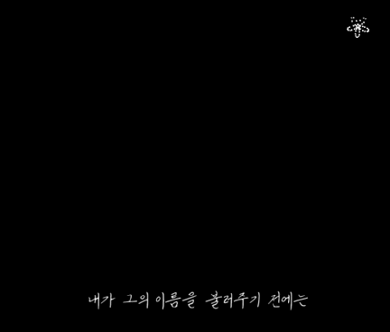
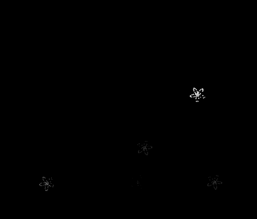
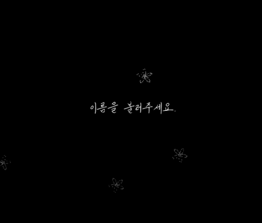
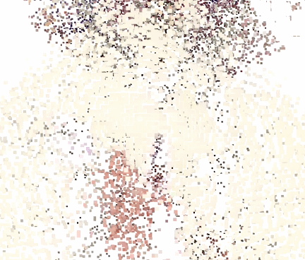
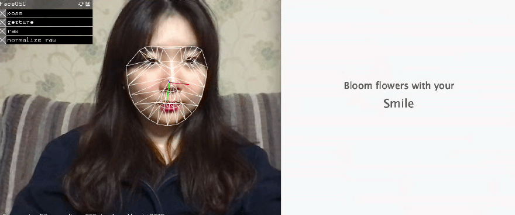

# MediArts 🧝‍♀️
### Media art projects using [Processing IDE](https://processing.org/) 

> Belows are several media arts using several interactions such as face recognition and recursion. Each projects have its own theme and interactions. 

Please enjoy watching! (star🌟 if you enjoy) 

## Project1 : Blinking Dots
</img>
  

## Project2 : Growing Colors
</img>
  

## Project3 : Pictures in the picture
</img>
</img>
  

## Project4 : My Pizza maker
</img>
</img>
  

## Project5 : Interactive Poem
</img>
</img>
 

</img>
</img>
YouTube 👉 [Video](https://youtu.be/59X9kSgl-9g)
  

## Project6 : Heart Explosion
</img>
</img>

  

## Project7 : Blooming Smile
</img>

  

